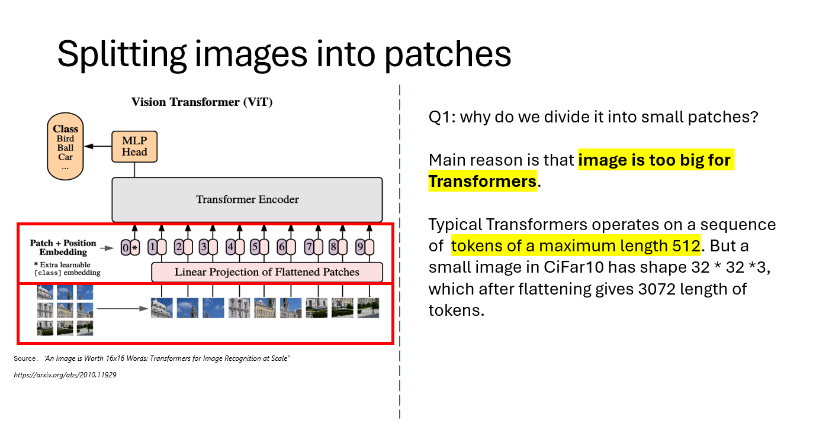

# Implement ViT from Scratch 
This repo is a blog of my studying how to implement the paper of ViT (Visual Transformer) from scratch.

Paper source: [An Image is Worth 16x16 Words: Transformers for Image Recognition at Scale](https://arxiv.org/abs/2010.11929)

# Tutorial 
I made a tutorial describing the key operations and insights in ViT, and you can view it at [pdf link](./tutorial/ViT%20Tutorial.pdf)

- Why we split?

- How we split?

    - Using a sliding window of the same size as patch size
    - Essentially convolve a kernel of `kernel_size=patch_size` and `stride=patch_size` on the image

- cls_token and position embedding

- Why do we need Positioning Embedding?
    - Experiments of this [paper](https://arxiv.org/abs/2105.10497) show better result in permutation
    - Another crucial reason is that there is **no strong Prior Information** assumption being made

# Dataset

MNIST images from kaggle [site](https://www.kaggle.com/datasets/oddrationale/mnist-in-csv?resource=download&select=mnist_test.csv)
